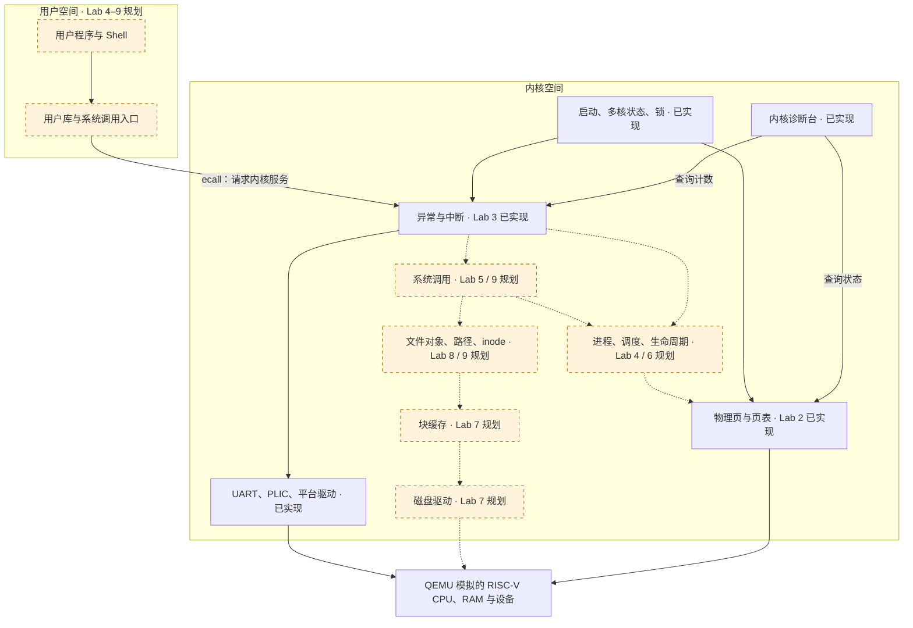

# PugeZhangOS：整个操作系统的架构

先看这张图，再进入对应实验。**Lab 是每个阶段的完整版本；目录中的模块才是操作系统的组成部分。**两者分别回答“我做到了哪一步”和“这部分负责什么”。

当前可运行的是 Lab 1–3；Lab 4–9 已整理接入规划，尚未实现。

## 1. 最后要形成怎样的系统



黄色虚线模块是后续规划。当前 `pgos>` 是内核诊断台；Lab 9 的 Shell 会是用户程序，两者分别拥有自己的代码和执行权限。

## 2. 实验目录和系统模块怎样对应

```text
PugeZhang/
├── ARCHITECTURE.md       整个系统的地图：先读这里
├── README.md             实验索引、运行与验收
├── lab0/                 环境与参考 xv6
├── lab1/                 启动和输出的完整版本
├── lab2/                 加入内存管理的完整版本
├── lab3/                 加入中断的完整版本；当前最新可运行基础
├── lab4/ … lab9/         各阶段目标、依赖与接入规划，尚无实现
├── docs/
│   ├── ROADMAP.md        Lab 0–9 的建设顺序和交付边界
│   ├── DEVELOPMENT.md    下一阶段怎样在现有基础上继续
│   └── COURSE_SCOPE.md  课程依据与核对范围
└── scripts/check.py      当前 Lab 1–3 的自动运行检查
```

以 `lab3/` 为例，内部的真实代码框架如下。Lab 1、2 使用相同职责划分，只保留它们已经需要的模块：

```text
lab3/
├── boot/          汇编入口、进入 C 内核、启动 DTB 检查
├── kernel/        main.c 启动编排、bootstate.c 多核状态、spinlock.c 锁
├── mm/            page.c 物理页，vm.c 页表与地址翻译
├── trap/          entry.S 保存和恢复现场，trap.c 处理原因
├── drivers/       UART、PLIC、QEMU 平台退出设备
├── lib/           格式化输出、内存工具、SBI 固件调用
├── monitor/       monitor.c 输入命令，diagnostics.c 展示状态
├── tests/         自检编排、多核并发检查
├── include/       每个模块对外提供的接口
├── docs/          本实验的个人记录与运行证据
│   └── evidence/  按 cpuN/ 保存构建、ELF、串口日志
├── linker.ld      本阶段内存布局
└── Makefile       本阶段构建和模拟器入口
```

`main.c` 只安排步骤，不拥有页池、页表、输入缓冲、命令解析或测试细节。状态放在负责它的模块中，由头文件声明接口，其他模块通过接口调用。

## 3. 每个模块管什么，后续扩展到哪里

| 模块 | 现在负责什么 | 后续接入点 |
| --- | --- | --- |
| `boot/` | 给核心设置栈，处理启动约定 | 保持稳定，按平台要求调整 |
| `kernel/` | 全局初始化、每核就绪、锁 | 启动时再安排进程、磁盘和文件系统初始化 |
| `mm/` | 物理页池、内核页表、权限 | Lab 4/5：用户页表、用户内存分配与安全复制 |
| `trap/` | 进入异常/中断、保存现场、分发、返回 | Lab 4：区分 U/S 入口；Lab 5：接入系统调用；Lab 6：接入抢占 |
| `drivers/` | 读写设备寄存器、处理设备通知 | Lab 7：VirtIO 磁盘驱动及完成通知 |
| `lib/` | 基础字符串/内存操作、打印、固件调用 | 继续提供小而明确的工具 |
| `monitor/` | 解析诊断命令、读取状态并展示 | 展示进程、调度、磁盘与文件系统状态 |
| `tests/` | 编排实际检查 | 每个新增模块加入行为验证 |
| `proc/`（规划） | 尚未实现 | Lab 4：进程；Lab 6：调度和生命周期；Lab 9：exec |
| `syscall/`（规划） | 尚未实现 | Lab 5：调用分发与参数；Lab 9：文件系统调用 |
| `block/`（规划） | 尚未实现 | Lab 7：磁盘块缓存 |
| `fs/`（规划） | 尚未实现 | Lab 8：inode、目录与路径；Lab 9：文件对象 |
| `user/`（规划） | 尚未实现 | Lab 4：首个程序；Lab 5：用户库；Lab 9：Shell |

括号中标为规划的目录将在实现对应阶段时加入该实验的源码。现在没有放空函数来假装模块已经存在。

## 4. 现有接口，怎样连接起来

这些接口已经在 Lab 3 中实现；Lab 1、2 的接口按本阶段能力有所减少。

| 接口 | 所属模块 | 调用者需要知道什么 |
| --- | --- | --- |
| `boot_publish_global()` / `boot_wait_global()` | `kernel/bootstate.c` | 主核完成共享初始化后发布，其他核心等待 |
| `boot_hart_ready()` / `boot_wait_all()` | `kernel/bootstate.c` | 各核心分别报告完成，主核等待全体就绪 |
| `boot_snapshot()` | `kernel/bootstate.c` | 查询有效核心的已发布记录；未就绪时阶段和 satp 返回零，内部数组不外露 |
| `page_alloc()` / `page_free()` | `mm/page.c` | 使用对应页池，按 4096 字节页管理资源 |
| `vm_init()` / `vm_enable()` | `mm/vm.c` | 一个核心建共享页表，每个核心分别启用 |
| `trap_init_hart()` / `trap_enable()` | `trap/trap.c` | 先准备处理入口，再启用允许的中断 |
| `uart_getc()` | `drivers/uart.c` | 取得字符或“暂无输入”；不暴露接收环数组 |
| `monitor_run()` | `monitor/monitor.c` | 进入诊断循环，命令解析不进入中断处理函数 |
| `selftest_prepare()` / `selftest_hart()` / `selftest_parallel_result()` | `tests/selftest.c` | 准备基线、每核并发检查、全体完成后汇总；`selftest_run()` 另执行模块自检 |

内存模块中的私有映射函数、空闲链表和位图留在对应模块。部分模块自检也留在那里，`tests/` 负责编排，不为了测试把所有内部数据暴露出来。

## 5. 两条实际执行路径

**启动路径：**

```text
QEMU / OpenSBI
  → boot/entry.S：准备栈
  → boot/start.c：进入 C 内核
  → kernel/main.c：组织初始化
       → 打印和驱动
       → mm：页池与共享页表
       → 启动其他核心（它们等待），再发布全局就绪
       → 各核启用页表、安装 trap、完成本核检查
       → 全体就绪、汇总检查
  → monitor_run()
```

Lab 1 自己完成 M→S，尚无 `mm/`。Lab 2 不开设备和时钟中断。Lab 3 在准备完成后开启中断；每个核心分别管理自己的开关。

**Lab 3 输入路径：**

```text
终端字符 → UART → PLIC → trap/entry.S → trap_handle()
  → drivers/uart.c：读设备，放入缓冲
  → 恢复寄存器并返回
  → monitor/monitor.c：取字符、编辑命令
  → monitor/diagnostics.c：查询模块接口、展示结果
```

中断路径做接收和计数，命令处理留在正常执行流。后续磁盘完成通知也可以沿这个边界接入，睡眠和唤醒则由进程模块管理。

## 6. 为后六个实验保留的边界

- **用户程序访问内核：**通过系统调用。用户指针需要经过用户页表检查和安全复制；当前“用户页池”还不等于完整用户地址空间。
- **调度访问中断：**时钟处理报告事件，进程模块决定是否切换；上下文切换和普通中断返回分别维护。
- **文件系统访问磁盘：**文件接口 → 路径/inode → 块缓存 → 磁盘驱动。Shell 不直接操作磁盘块。
- **诊断访问状态：**调用各模块的查询接口，不直接改页表、进程表或磁盘队列的内部数组。
- **平台行为和固件行为：**`drivers/platform.c` 管 QEMU 退出设备，`lib/sbi.c` 管 SBI 请求，两者已经分开。

这里确定的是模块责任与依赖。未来函数的细节、磁盘格式和课程指定接口，要等对应课件并结合实际实现确认。

## 7. 怎样继续，以及怎样展示特色

[建设路线](docs/ROADMAP.md)列出后续实验；[开发约定](docs/DEVELOPMENT.md)说明如何从上一阶段接续。

特色始终围绕“让内核状态可以被解释”：当前有每核启动记录、页归还检查、地址翻译窗口和真实中断计数。后续可沿用诊断接口显示进程状态、上下文切换次数、缓存命中与路径查找过程。后四项现在是规划，不是已运行的功能。

课程依据与核对范围见 [课程对照](docs/COURSE_SCOPE.md)。自动运行证据归各实验：[Lab 1](lab1/docs/evidence/summary.txt)、[Lab 2](lab2/docs/evidence/summary.txt)、[Lab 3](lab3/docs/evidence/summary.txt)。
