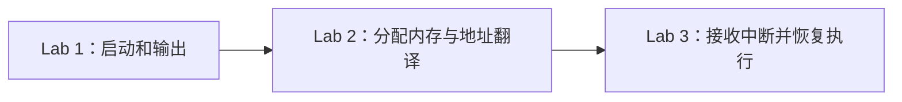

# Lab 1 → Lab 2 → Lab 3：架构与阅读路线

先看 [整个操作系统的架构](../ARCHITECTURE.md) 和 [后续 Lab 4–9 接续路线](ROADMAP.md)。这份文件专门解释已经实现的 Lab 1–3。

先把三个实验的目标分清：



每个目录保留到该阶段为止的完整实现。读 Lab 1 时只需要进入 `lab1/`；它没有 Lab 2 的页分配器和页表，也没有 Lab 3 的 PLIC、接收环或定时器。

## 从哪个文件开始

| 实验 | 建议阅读顺序 | 读完要能解释的路径 |
| --- | --- | --- |
| [Lab 1](../lab1/README.md) | `linker.ld` → `boot/entry.S` → `boot/start.c` → `kernel/main.c` → `drivers/uart.c` → `lib/console.c` | 内核加载在哪 → 栈在哪 → 怎样进入 S 模式 → 怎样输出字符 |
| [Lab 2](../lab2/README.md) | `kernel/main.c` → `mm/page.c` → `mm/vm.c` → `include/riscv.h` → `trap/trap.c` | 怎样拿到一个物理页 → 怎样建立页表 → 怎样让 CPU 使用页表 → 怎样证明权限生效 |
| [Lab 3](../lab3/README.md) | `kernel/main.c` → `trap/entry.S` → `trap/trap.c` → `drivers/plic.c` → `drivers/uart.c` → `lib/sbi.c` | 事件发生 → 保存现场 → 处理设备或时钟 → 恢复现场 → 继续原程序 |

上表中的路径都相对于对应实验目录。例如 Lab 2 的 `mm/page.c` 就是 `lab2/mm/page.c`。

## 哪些相同，哪些改变

| 模块 | Lab 1 | Lab 2 | Lab 3 |
| --- | --- | --- | --- |
| 加载地址 | `0x80000000` | `0x80200000` | `0x80200000` |
| 进入 S 模式 | 自己设置 M 模式状态并执行 `mret` | OpenSBI 固件已经完成 | 沿用 Lab 2 |
| 独立栈与多核启动记录 | 有 | 有；通过 SBI 启动其他核心 | 沿用 Lab 2 |
| UART 输出、格式化、自旋锁 | 有 | 保留 | 保留 |
| 物理页与 Sv39 | 无 | 双页池、三级页表、权限保护 | 保留 |
| UART 输入 | 轮询读取设备 | 轮询读取设备 | 中断接收，主程序读取缓冲 |
| 陷阱入口 | 意外异常诊断后停机 | 增加可控页权限异常验证 | 增加完整中断处理与寄存器恢复验证 |
| 时钟、PLIC | 无 | 页表预留 PLIC 映射；未启用中断 | 每核时钟、UART 外部中断 |

## 为什么同名文件会出现三份

课程是逐步增加功能的。同名文件保留各阶段的版本，打开任何一个实验都能看到该阶段真实执行的代码，也可以把两个文件并排比较。

例如：

```bash
diff -u lab1/boot/start.c lab2/boot/start.c
diff -u lab2/trap/trap.c lab3/trap/trap.c
diff -u lab2/drivers/uart.c lab3/drivers/uart.c
```

第一组比较说明启动权限怎么改变；第二组说明增加了哪些中断处理；第三组说明输入怎样从轮询变成缓冲接收。上述命令在仓库根目录执行。

这样做需要分别维护阶段快照。修复三阶段共用的基础代码时，要检查三个目录；每个阶段的构建和运行验证也分别执行。根 Makefile 与验证脚本只负责导航和检查，不包含内核实现。

## 每个实验怎样证明自己完成了

- Lab 1：所有核心都有不重叠的栈，启动记录完整，多核打印不互相穿插，整数和格式化边界测试通过。
- Lab 2：分配的页不会重复，错误释放被拒绝，自检后页数恢复；CPU 实际通过两个地址访问同一个页，并实际触发预期的未映射和只读权限异常。
- Lab 3：每个核心的时钟计数持续增长；输入字节确实经过 PLIC/UART 中断路径；陷阱测试验证寄存器恢复。

运行方法与本次证据见 [根目录说明](../README.md#验证) 和各实验自己的 README。

实验仍是内核基础设施。没有用户进程、系统调用、调度、磁盘或文件系统；这些属于后续实验。

本次整理依据用户 2026-10-08 的要求：按实验分开，并提高阅读清晰度。代码与验证由 Agent 完成，个人操作记录保持原样。

## 当前模块边界

`kernel/main.c` 只安排启动顺序；`kernel/bootstate.c` 拥有多核记录与同步；`mm/` 拥有页与页表；`trap/` 拥有异常/中断入口；`monitor/` 处理命令和展示；`tests/` 编排自检。未来进程、系统调用、磁盘和文件系统沿 [系统框架](../ARCHITECTURE.md) 接入，不继续堆在 `main.c` 中。

2026-10-08 按模块重整理后，Lab 1–3 各自的 1、2、3、8 核配置全部通过，0 个失败；仓库外独立编译也全部通过。[运行汇总](evidence/lab123-split/summary.txt) · [独立构建](evidence/lab123-split/standalone-build.txt)。
