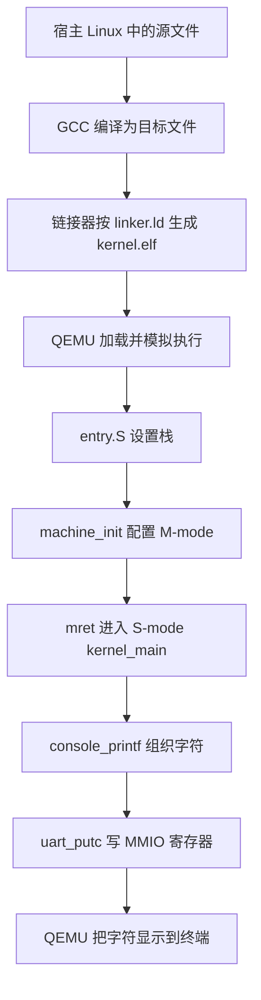

# Lab 1 重做：先理解，再实现，再证明

> 这是先前逐步教学方案的历史记录。2026-10-05 用户授权一轮完成 Lab 1–3，实现与验证由 Agent 推进；当前方案见 [Lab 1–3 设计](LAB123_DESIGN.md)。下面的旧问题表对应修改前代码，不是最新验收结果。

这份方案面向“会基础 C，指针和底层原理需要边做边学”。当前只推进 Lab 0 和 Lab 1；后续实验只保留路线图。

## 为什么要重做

当前独立内核不是完全跑错了：从源码重新编译后，单核和三核都能打印启动信息。需要重新设计的是学习路径、可靠性验证和版本记录。

重新编译及两处格式化边界错误的复现记录：[Agent 审查证据](evidence/lab1-audit.txt)。宿主上的检查工具用于验证同一份格式化逻辑，不意味着内核变成了宿主程序。

| 当前问题 | 对实验的影响 | 重做时怎么处理 |
| --- | --- | --- |
| Git 历史是旧 xv6，新独立内核大部分未跟踪 | 线上提交不能准确反映当前代码 | 保留历史快照，理解差异后整理提交 |
| 工作日志仍描述旧 xv6 的锁、调度和更完整追踪 | 容易把历史成果误当当前功能 | 保留为历史，写新的本人记录 |
| 只有 hart 0 输出，其他核只写标记 | 三核启动不能证明串口并发安全 | 后续独立做多核打印和锁实验 |
| hart 0 读其他核标记前没有完成同步 | 快照可能因启动时序而变化 | 明确设计完成发布与读取顺序 |
| printf 对最小负整数和字符串末尾 `%` 处理有问题 | 常规 Hello 输出掩盖边界错误 | 本人先定格式规则，再实现和验证 |
| 没有明确配置 PMP 的机器态访问权限 | 本次老 QEMU 可跑，迁移环境存在隐患 | 启动课中解释并选择明确的权限设置 |
| 当前 `-bios none`，Lab 2/3 课件使用 OpenSBI | 后续地址与定时器设计可能混用 | Lab 1 先学 M→S；进入 Lab 2 前明确固件路线 |

## 保留与重写

保留项目名称、README 中的成员信息、版本历史、工具链、QEMU 和旁边的 xv6。保留旧实现及日志作为比较对象，不删除学习痕迹。

`Makefile`、`linker.ld` 和 CSR 访问封装保留作讲解材料，逐项核对后作为基础设施使用；添加 CPU 数选择、头文件依赖和调试目标时，由 Agent 辅助，本人解释实际命令。

`entry.S` 和 M→S 初始化由 Agent 分小段讲解，本人写出每段作用并实际用 GDB 观察后重建。汇编和硬件寄存器约定不要求靠猜测发明，但要求能说明它们为什么必要。

串口单字符输出、字符串输出、整数转换、格式解析、每核状态记录和锁的核心行为由本人逐步实现。Agent 可以给接口、伪代码、提示和审查，不提前交付完整答案。

`shell/` 继续独立保留，作为 Linux 进程练习，暂不接入内核。旧 `*.o`、`kernel.elf` 保留在快照中；未来构建产物不当作自己编写的源码或完成证明。

## 先理解架构

先掌握五个概念即可：入口地址、函数栈、特权级、指针、MMIO。不要一开始同时引入页表、用户进程和文件系统。

MMIO 的学习顺序：普通指针指向内存 → 某些地址对应设备寄存器 → 通过 `volatile` 指针读写设备状态和数据。`volatile` 不能代替跨核同步或原子操作。

内核没有宿主 Linux 提供的 C 运行环境，所以不能直接调用宿主 `printf`；编译器的变参支持可用。不要将变参理解成“全部参数都连续存放在栈上”，实际取参依赖目标 ABI。

## Lab 1 的七步

| 步骤 | 本人必须完成 | Agent 的工作 | 验收证据 |
| --- | --- | --- | --- |
| 1. 构建和入口 | 解释 `.c/.S/.o/.elf`；亲手编译，查看 ELF 入口 | 讲解 Makefile、链接脚本和工具输出 | 入口与 `_boot` 地址对应的记录 |
| 2. 进入 C 与切换特权级 | 标注栈设置；说明 `mepc/MPP/mret`；亲手调试 | 提供最小硬件框架和 GDB 操作指导 | `_boot`、`machine_init`、`kernel_main` 三处停下；记录关键寄存器 |
| 3. 只打印一个字符 | 自己实现轮询条件及发送；解释指针访问 | 给寄存器定义、提示和审查 | 出现一个指定字符，能解释等待什么 |
| 4. 打印字符串和整数 | 写循环及进制转换；先在纸上走通例子 | 协助定位错误，提供边界输入 | 空串、0、正数、负数、十六进制等结果 |
| 5. 最小 printf | 自己定格式规则并写解析核心 | 解释变参接口、审查类型和边界 | `%d/%x/%p/%s/%%`；最小负数、末尾 `%` 的明确行为 |
| 6. 多核启动 | 解释独立栈；写每核记录逻辑；亲手运行单核/三核 | 辅助完成同步设计，审查发布/读取顺序 | 每个活动核有完整记录；未启动的核不误判失败 |
| 7. 并发输出与锁 | 先预测，再运行无锁/有锁对比；写锁的核心思路 | 讲解原子操作及中断约束，检查死锁风险 | 每核固定数量打印；有锁时整次打印完整，核之间顺序允许变化 |

一步通过再进入下一步。本人能运行、解释并完成一个小修改后，才把该步骤标为完成。学不会时先退回小例子，不让 Agent 用更多代码覆盖疑问。

Lab 1 课件把自旋锁列为附加任务。本项目把它作为后续 Lab 2 共享内存管理的预备练习，但不要在第一次打印字符前引入锁。

## 一个小巧思：每个核的启动记录

先完成核心功能，再加这项。记录实际到达的阶段，而不是只打印一行固定的成功消息。

第一版只做三阶段位掩码：入口、机器态初始化、内核入口。本人先说明为什么三个阶段对应 `1/2/4`，全部到达时为 `7`。

进阶版使用每核固定容量的小事件数组，记录阶段顺序，并显示该核的栈范围。无需动态分配、时间戳或复杂日志系统。每个核只写自己的记录，完成后通过明确的原子发布/获取同步交给输出核；启动记录本身不承担启动控制。

用 GDB 暂停某个核，观察未完成状态；释放后再看完成结果。这样能证明输出反映真实启动过程。错误状态先记录到内存，不在串口尚未可用时打印。

这项特色的价值是帮助本人调试和理解多核，不是增加代码量。基础 printf 和启动仍能脱离该功能独立工作。

## Agent 使用约定

- 每次先让我说需求和预测，再给提示；不能一次生成整个实验。
- 核心逻辑先由本人尝试。卡住时依次给定位提示、伪代码、小段解释，不立即替换整文件。
- Makefile、GDB 命令和硬件常量可由 Agent 辅助；本人要说明它们的作用。
- Agent 可以做独立验证，但报告要写清“Agent 运行”与“本人运行”，不得混记。
- 不从 xv6 复制完整函数。阅读后先写出自己的接口、数据结构和不变量，再自行实现。
- Agent 辅助代码在记录中注明来源和改动；本人理解后决定是否保留。不编造手写经历。
- 本人按真实阶段整理提交；Agent 不自动完成最终提交、推送或课程登记。

这是一份项目内的协作分工，不宣称它等同于课程对所有 AI 用法的详细规定。课程明确提倡在前三个实验熟悉基础后，逐步使用 Agent 辅助后续实验。

课件的分支示意为 `master` 与 `lab-1` 至 `lab-9`，每次实验继承上一阶段。当前项目使用 `main` 且有旧历史。先保存快照、解释暂存区与工作区的差异，再由本人建立并维护实验分支；不为符合示意抹掉历史或伪造提交。是否需要把主分支名严格设为 `master`，按课程实际检查要求处理。

## 后续架构路线图

| 实验 | 加入的模块 | 届时要解释的核心问题 |
| --- | --- | --- |
| Lab 2 | 物理页分配、Sv39 页表 | 内存从哪里来？虚拟地址如何找到物理页？ |
| Lab 3 | 陷阱入口、UART/时钟中断 | 如何打断、保存和恢复执行？ |
| Lab 4 | 第一个用户进程 | 内核怎样把执行权交给用户程序？ |
| Lab 5 | 系统调用、用户虚拟内存 | 用户程序如何受控地请求内核服务？ |
| Lab 6 | 调度和进程生命周期 | 谁在运行？谁在等待？如何切换和回收？ |
| Lab 7 | 磁盘驱动和缓存 | 字节如何读写为磁盘块？ |
| Lab 8 | inode、dentry、路径 | 文件名怎样找到数据？ |
| Lab 9 | 文件管理和内核上的 Shell | 如何用自己的接口执行命令、访问文件？ |

Lab 4–9 是 Lab 0 提供的整体规划，具体要求以课件发布后的内容为准。现在不生成它们的代码。

Lab 0 还提到最后移植至开发板。完成 QEMU 中的各阶段后，需要按最终课程要求增加平台适配与实体板验证；当前未验证这部分，也无需现在购买或更换环境。

课程参考：[README](https://gitee.com/christinaaa/ecnu-oslab-2026-task)、[Lab 1](https://gitee.com/christinaaa/ecnu-oslab-2026-task/blob/master/lab-ppt/拔尖班-lab-1.pptx)、[Lab 2](https://gitee.com/christinaaa/ecnu-oslab-2026-task/blob/master/lab-ppt/拔尖班-lab-2.pptx)、[Lab 3](https://gitee.com/christinaaa/ecnu-oslab-2026-task/blob/master/lab-ppt/拔尖班-lab-3.pptx)。
